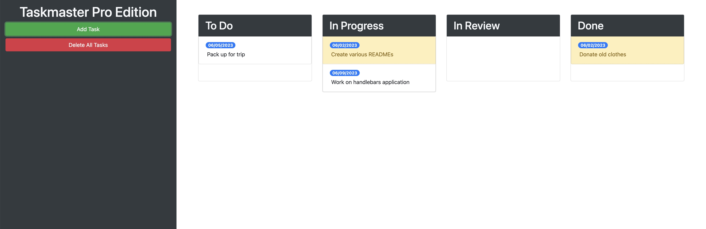

# Taskmaster Pro by CS

This is my first javascript project using JQuery. This is a task organizer app for a user to create, edit, and organize their tasks based on level of completion. This is also my first draggable UI project, allowing the user to click and drag their tasks to any category, order, or can be dragged to the delete box at the bottom of the page. Additional features include adding dates and color coded alerts to show the user if the task deadline is in less than two days or past due. 

The link to my personal taskmaster pro is below. While the app link is fully functional, this link is only for showing purposes. If you wish to use the application for your own personal links, please download the application through github to your local drive and use it locally. 

Link: https://cesarsiguencia.github.io/taskmaster-pro/

### Screenshots

